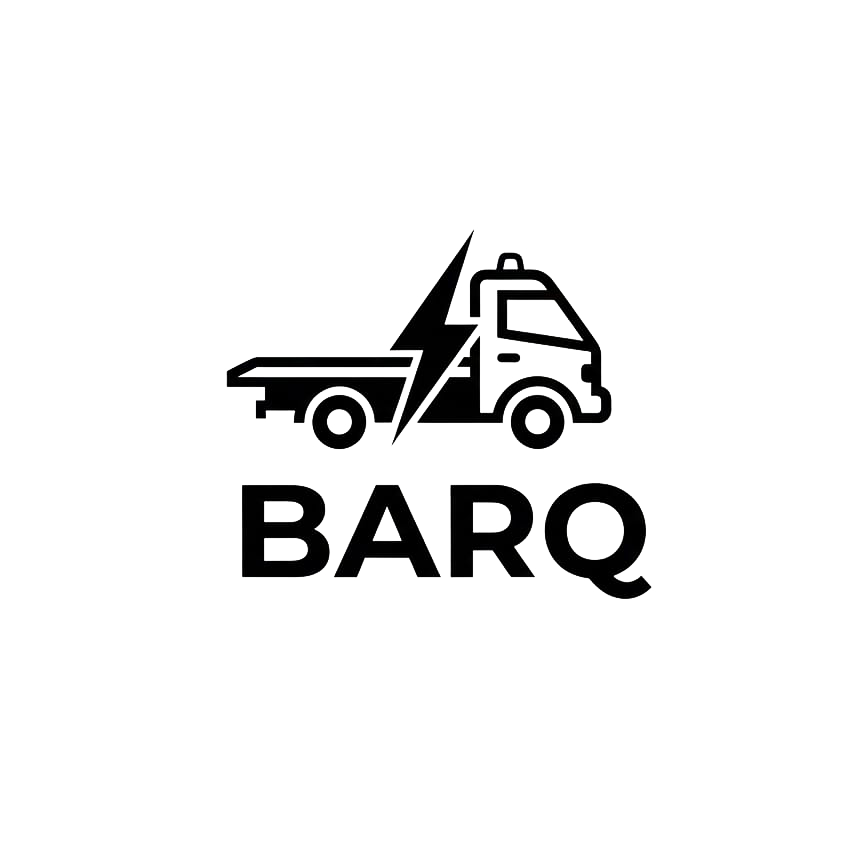

{width="1.35in"}

University of Bahrain

College of Information Technology

Department of Information Systems

**BARQ: VEHICLE TOWING APP**

**Prepared by**

**Mansoor Sayed Majed 202202969**

**Salman Muslem Abdulla 202206786**

**Mohammed Ali Ebrahim 202202975**

**For**

**ITIS 499**

**Senior Project**

**Academic Year 2025-2026 - Semester 2**

**Project Supervisor: Ghassan Mohammed Anwar Al Koureiti**

**Date of Submission: 09 May 2026**

\newpage

# Abstract

BARQ is an AI-supported mobile towing application designed to make roadside assistance in Bahrain faster, clearer, and more organized. The application connects vehicle owners with nearby towing drivers through a two-sided mobile platform. Customers can register, request a tow, choose pickup and destination locations on a Bahrain map, view nearby available drivers, receive a price estimate, and track service progress. Drivers can manage their driver profile, share live location, view requests, accept or decline jobs, start trips, complete trips, and maintain a service history.

BARQ was developed using Flutter and Dart for the mobile application and PocketBase for backend data management, authentication, real-time updates, and access control. The system uses OpenStreetMap and Nominatim for map tiles and place search, OSRM and Google Directions for route calculation, Google Geocoding for accurate Bahrain location lookup, and Gemini-based AI services for support chat, driver application review, report moderation, and cancellation review. The application supports English and Arabic, including right-to-left layout, and provides a dark/light theme to improve usability in different conditions.

The main contribution of BARQ is the digital transformation of a traditionally phone-based towing process. Instead of relying on manual calls, unclear prices, and repeated driver updates, the system offers location-based requests, transparent pricing tiers, live driver tracking, ratings, driver reports, and AI-assisted support. This report presents the project background, literature review, business plan, project management, requirements, system design, implementation, testing, limitations, and future work.

# Acknowledgments

We would like to express our sincere thanks and appreciation to everyone who supported us during the completion of our senior project, BARQ: Vehicle Towing App. First, we would like to thank our project supervisor, Ghassan Mohammed Anwar Al Koureiti, for his guidance, advice, and continuous support throughout the project. His feedback helped us improve our ideas, solve problems, and stay on the right track during the development process.

We would also like to thank the Department of Information Systems at the University of Bahrain for giving us the opportunity to apply what we learned during our studies in a practical project. Finally, we are grateful to our families, friends, and colleagues for their encouragement, patience, and support. Their motivation helped us complete this project successfully.

# Table of Contents

Abstract

Acknowledgments

List of Tables

List of Figures

Chapter 1: Introduction

Chapter 2: Literature Review

Chapter 3: Business Plan

Chapter 4: Project Management

Chapter 5: Requirement Collection and Analysis

Chapter 6: System Design

Chapter 7: System Implementation and Testing

Chapter 8: Conclusion and Future Work

References

Appendices

# List of Tables

Table 3.1: SWOT analysis of BARQ.

Table 3.2: Business model canvas.

Table 3.3: Problem-solution fit.

Table 3.4: Competitor analysis.

Table 3.5: Financial planning assumptions.

Table 4.1: Project risk register.

Table 4.2: Project activity plan.

Table 5.1: Functional requirements.

Table 5.2: Non-functional requirements.

Table 5.3: Personas.

Table 6.1: PocketBase database collections.

Table 7.1: Sample test cases.

Table 7.2: BARQ strengths and weaknesses.

# List of Figures

Figure 4.1: Project roadmap.

Figure 5.1: Use case model summary.

Figure 5.2: Accept and complete tow request sequence.

Figure 6.1: System architecture.

Figure 6.2: Customer request flow.

Figure 6.3: Driver service flow.

\newpage

# Chapter 1: Introduction

Mobile applications are now widely used to make services faster, easier, and more organized. Transportation and roadside assistance services can benefit from this shift because users usually need help under stressful conditions. A driver whose vehicle breaks down often needs a tow quickly, but traditional towing services still depend heavily on phone calls, verbal location descriptions, uncertain prices, and repeated follow-up calls to know where the tow truck is.

BARQ: Vehicle Towing App was designed to improve this process. The application allows customers to request a tow, select pickup and destination locations on a map, view nearby drivers, estimate the cost, and track the tow driver in real time. BARQ also includes a driver mode, AI support chat, driver application review, driver reports, ratings, Arabic and English support, dark mode, and a PocketBase backend that stores requests and broadcasts updates.

## 1.1 Problem Statement

The current process of requesting a towing service can be slow and unclear because it often depends on manual coordination. When a vehicle breaks down, the customer may not know which towing driver is available, how far the driver is, how long arrival will take, or how much the service will cost. The customer may also struggle to explain the exact pickup location over the phone, especially at night or in an unfamiliar area.

Towing drivers also face difficulties. They may receive incomplete customer information, unclear pickup locations, or jobs that are too far away. Without a shared digital request record, it is harder to keep both customer and driver synchronized. There is also limited accountability when a driver behaves poorly, cancels without a strong reason, or does not complete the request correctly.

Therefore, there is a need for a mobile application that organizes towing requests, uses map-based pickup and destination selection, displays nearby drivers, estimates prices before confirmation, provides live tracking, and gives customers a safe way to rate or report drivers after the service.

## 1.2 Project Objectives

The main objective of this project is to design and develop BARQ, an AI-supported mobile towing application for Bahrain. The project objectives are:

1. Provide a customer mobile interface for requesting a tow using pickup and destination locations.
2. Provide a driver mobile interface for managing availability, receiving requests, accepting or declining jobs, and updating trip status.
3. Provide real-time driver tracking so customers can follow service progress on a map.
4. Provide transparent price estimation using fixed distance tiers and a night surcharge.
5. Support customer safety through ratings, driver reports, and AI-assisted moderation.
6. Support driver onboarding through document submission and AI-assisted application review.
7. Support English and Arabic interfaces, including right-to-left layout for Arabic users.
8. Use a maintainable technology stack based on Flutter, PocketBase, map APIs, and AI services.

## 1.3 Relevance and Significance of the Project

BARQ is relevant because vehicle breakdowns are unexpected and can happen at inconvenient times. In these situations, users need fast support, clear information, and confidence that the service is reliable. A digital towing platform can reduce uncertainty by showing the request status, driver location, estimated arrival time, and estimated service price.

The project is also significant from an information systems perspective. It combines mobile development, backend data management, real-time updates, location services, bilingual user experience, and AI-assisted decision support in one practical platform. It demonstrates how traditional service industries can be improved through digital transformation without requiring a large call center or expensive enterprise system.

## 1.4 Report Outline

The rest of this report is organized as follows. Chapter 2 presents the literature review and discusses entrepreneurship, transportation platforms, mobile applications, AI-supported services, map-based systems, and matchmaking business models. Chapter 3 presents the business plan, including the business overview, SWOT analysis, business model canvas, validation, marketing plan, and financial plan. Chapter 4 explains project management, including the development process, risks, activity plan, and roadmap. Chapter 5 presents requirement collection and analysis, including functional requirements, non-functional requirements, personas, and system models. Chapter 6 describes system design, including architecture, database design, user interface design, system flows, and object-oriented design. Chapter 7 explains implementation and testing. Chapter 8 concludes the report and presents limitations and future work.

\newpage

# Chapter 2: Literature Review

This chapter reviews concepts and technologies related to BARQ. The project is connected to entrepreneurship, the towing and roadside assistance market, mobile application development, intelligent transportation systems, map-based services, AI support, and matchmaker platform business models.

## 2.1 Entrepreneurship

Entrepreneurship is the process of identifying a problem, creating a solution, and turning that solution into a sustainable product or service. BARQ follows this approach because it identifies a common service problem in Bahrain: users need towing help, but the current process is often manual and unclear. The proposed solution is a mobile platform that connects customers and towing drivers through a structured digital workflow.

BARQ also has entrepreneurial value because it creates benefits for both sides of the market. Customers receive faster and clearer access to towing services, while towing drivers gain a new channel for receiving requests and building trust through ratings and verified profiles.

## 2.1.1 Entrepreneurship Concept

The entrepreneurship concept behind BARQ is based on solving a real local problem with a practical digital service. Rather than creating a general car service marketplace, BARQ focuses on towing, which is urgent and location-dependent. This narrow focus makes the app more suitable for a mobile-first design with map selection, nearby driver matching, live tracking, and instant price estimation.

## 2.2 Roadside Assistance and Towing Industry

The towing industry provides essential support when vehicles break down, are involved in accidents, or need to be moved to another location. In traditional towing services, customers commonly contact providers by phone. This approach works, but it has weaknesses: location may be unclear, pricing may be negotiated informally, driver arrival time may be unknown, and service history may not be stored in a structured way.

Digital platforms can improve this industry by creating a request record, connecting customers with nearby drivers, showing live location, storing ratings, and allowing the provider to analyze service performance. These features are already common in ride-hailing and delivery applications, but they are less common in towing services.

## 2.2.1 Roadside Assistance Definition

Roadside assistance is a service that helps vehicle owners when their vehicles cannot continue safely. It may include towing, battery support, tire support, fuel delivery, or vehicle transport. BARQ focuses on towing as its core service. The customer selects pickup and destination points, chooses a vehicle type, adds details, and sends the request to nearby drivers.

## 2.2.2 Roadside Assistance Development

Roadside assistance has evolved from phone-based dispatch to digital dispatch. In older systems, the customer calls an operator or driver, describes the location, and waits for updates. Modern systems use GPS, mobile apps, digital maps, and real-time status updates. BARQ applies these modern ideas to the Bahrain towing context by using location services, Bahrain-restricted search, fixed pricing tiers, and bilingual mobile screens.

## 2.3 Technology Trends in Roadside Assistance

Several technology trends support the BARQ concept:

1. Mobile-first service booking, where users request help directly from a phone.
2. Real-time location sharing, where driver location is updated during the service.
3. Map-based pickup and destination selection, reducing location confusion.
4. AI-assisted support, where users can ask questions inside the app.
5. AI moderation, where reports, cancellations, and driver applications can be reviewed before human escalation.
6. Lightweight backend systems, where small teams can build reliable products using hosted or self-hosted backend services.

## 2.3.1 Impact of Technological Advancements

Technological advancement improves towing services by making dispatch faster and more transparent. GPS reduces pickup-location confusion. Real-time backend updates reduce repeated calls. AI support can answer common questions quickly. Digital profiles, ratings, and reports improve trust and accountability. In BARQ, these technologies are combined into one service flow.

## 2.3.2 Impact of E-commerce and Digital Platforms

E-commerce has changed user expectations. Customers now expect clear prices, simple booking, digital status updates, service history, and support inside the app. BARQ applies these expectations to towing. Although towing is a physical service, the discovery, request, tracking, rating, and support processes can be handled digitally.

## 2.4 Matchmaking Business Model

BARQ uses a matchmaker business model. The platform connects two user groups: customers who need towing and drivers who provide towing. The value of the platform increases when more reliable drivers are available, because customers can receive faster service. It also increases when more customers use the app, because drivers receive more jobs.

The matchmaker model requires trust, clear rules, and efficient matching. BARQ supports this by storing driver profiles, showing driver rating and ride count, allowing customers to report issues, and using location to select nearby drivers.

## 2.4.1 Similar Businesses

Similar businesses include ride-hailing apps, delivery apps, and roadside assistance platforms. Ride-hailing applications demonstrate live driver tracking, status updates, ratings, and map-based matching. Delivery apps demonstrate driver/customer coordination and route tracking. Roadside assistance platforms show the need for urgent service support. BARQ combines the relevant features of these systems but applies them specifically to towing in Bahrain.

\newpage

# Chapter 3: Business Plan

This chapter presents the business plan for BARQ. It explains the business overview, vision, mission, feasibility, SWOT analysis, business model canvas, idea validation, industry analysis, competitor analysis, marketing plan, and financial plan.

## 3.1 Executive Summary

BARQ is a digital towing service platform that connects vehicle owners in Bahrain with nearby towing drivers. The application provides a structured solution to common towing problems, including unclear location communication, uncertain pricing, limited tracking, and weak accountability. BARQ gives customers a simple way to request a tow, select locations on a map, estimate cost, and track the driver. It gives drivers a way to receive requests, manage their profile, share location, and build reputation through ratings.

The business opportunity is based on the fact that towing is urgent, location-based, and trust-sensitive. A mobile platform can make the service easier for customers and more organized for drivers. BARQ can begin as a prototype and pilot platform, then grow through partnerships with independent tow drivers, garages, insurance offices, and roadside assistance providers.

## 3.2 Business Overview

BARQ operates as a matchmaker platform between two main groups:

1. Vehicle owners who need towing service.
2. Towing drivers who want more organized access to customers.

The platform does not need to own tow trucks in the first stage. Instead, it can onboard independent drivers and service providers. This reduces the startup cost and allows the business to focus on technology, trust, matching, and customer experience.

BARQ's main services are:

1. Tow request creation.
2. Pickup and destination selection.
3. Nearby driver matching.
4. Live tracking.
5. Price estimation.
6. Driver profile and availability management.
7. Customer support chat.
8. Rating and reporting.
9. Driver application review.

## 3.2.1 Vision and Mission

**Vision:** To become Bahrain's trusted digital platform for fast, transparent, and reliable towing services.

**Mission:** To simplify roadside towing by connecting customers with nearby verified towing drivers through a mobile app that provides map-based requests, clear pricing, live tracking, and AI-supported assistance.

## 3.3 Feasibility Study

BARQ is feasible because it uses available technologies and solves a clear user problem. Flutter allows the team to build a cross-platform mobile interface. PocketBase provides a lightweight backend for accounts, requests, and real-time updates. OpenStreetMap, OSRM, Google APIs, and AI APIs support map, routing, geocoding, and support functions.

The main feasibility challenge is market adoption. Drivers must be willing to use the platform, keep their location available, and respond to requests. Customers must trust the app enough to request towing through it instead of calling known drivers directly. These risks can be reduced through a small Bahrain pilot, driver verification, transparent pricing, and clear customer support.

## 3.3.1 SWOT Analysis

Table 3.1: SWOT analysis of BARQ.

| Strengths | Weaknesses |
|---|---|
| Clear local problem in towing and roadside assistance. | Prototype stage, not yet commercially launched. |
| Mobile-first request, tracking, and estimate flow. | Driver network must be built before service coverage is strong. |
| Supports customer and driver roles in one app. | Payment gateway and admin dashboard need further development. |
| Uses real-time PocketBase updates and map-based tracking. | iOS background tracking still needs full production testing. |
| Arabic and English support improves local usability. | AI support quality depends on API availability and prompt quality. |

| Opportunities | Threats |
|---|---|
| Partnerships with garages, tow drivers, insurance companies, and fleet operators. | Existing towing providers may prefer informal phone-based work. |
| Expansion from towing into roadside assistance services. | API cost increases can affect operating cost. |
| Driver ratings and verified profiles can improve trust. | Larger ride-hailing or roadside platforms could enter the market. |
| Data can support demand forecasting and driver positioning. | Location permission restrictions can affect tracking reliability. |

## 3.3.2 Business Model Canvas

Table 3.2: Business model canvas.

| Component | BARQ Plan |
|---|---|
| Customer Segments | Vehicle owners in Bahrain, independent tow drivers, garages, insurance partners, fleet operators. |
| Value Proposition | Fast towing requests, map-based pickup, transparent pricing, live tracking, verified drivers, bilingual support. |
| Channels | Mobile application, Instagram, TikTok, Google Business Profile, garage partnerships, referral codes. |
| Customer Relationships | In-app support chat, ratings, service history, issue reporting, driver verification. |
| Revenue Streams | Commission per completed tow, driver subscription after pilot, premium listing for service providers, B2B fleet plans. |
| Key Resources | Flutter app, PocketBase backend, driver network, map APIs, AI services, brand and support content. |
| Key Activities | Driver onboarding, request matching, backend maintenance, customer support, marketing, quality monitoring. |
| Key Partners | Tow drivers, garages, insurance offices, cloud hosting provider, map and AI API providers. |
| Cost Structure | Hosting, API usage, app maintenance, marketing, support operations, payment gateway fees, legal/compliance. |

## 3.3.3 Idea Validation

BARQ was validated through prototype development, analysis of similar ride-hailing and towing workflows, and usability testing of the core app flows. The application was tested through common tasks such as registering, requesting a tow, selecting map locations, estimating price, tracking service, changing language/theme settings, and using driver mode.

The validation results showed that users understand the dashboard quickly because the main actions are visible: Request Tow, Track Service, Support Chat, Get Estimate, and Become Driver. The map flow was useful because it reduced the need to describe pickup locations manually. Testing also showed that button layout, map feedback, and live driver movement needed careful design on smaller phones.

## 3.3.4 Problem-Solution Fit

Table 3.3: Problem-solution fit.

| User Problem | BARQ Solution |
|---|---|
| Customer cannot explain exact pickup location. | Customer selects pickup and destination on a Bahrain map. |
| Customer does not know service price before requesting. | App shows fixed-tier estimate and night surcharge before confirmation. |
| Customer does not know driver location. | Live tracking shows driver marker and service progress. |
| Driver receives unclear request details. | Request stores pickup, destination, vehicle type, notes, and customer data. |
| Customer lacks accountability after poor service. | Ratings and driver reports are stored and moderated. |
| Driver onboarding can be manual and slow. | Driver application form stores documents and supports AI-assisted review. |

## 3.4 Industry Analysis

The towing and roadside assistance industry is strongly location-dependent. Customers usually choose the provider that can reach them quickly and charge a fair price. In Bahrain, travel distances are shorter than in larger countries, which makes a map-based fixed-tier pricing model practical for an early prototype. The market also has many independent service providers, making the matchmaker model suitable.

Technology is changing the industry by increasing expectations for mobile booking, real-time tracking, and transparent pricing. Customers who use ride-hailing and delivery apps expect similar convenience from roadside services. BARQ uses this trend by applying familiar digital-service patterns to towing.

## 3.4.1 Industry Description and Trends

Important trends include:

1. Users expect digital-first service request flows.
2. Drivers need location-aware request assignment.
3. Customers expect transparent pricing and clear status.
4. Safety, ratings, and complaint handling are increasingly important.
5. AI can reduce support workload and help triage reports.

## 3.4.2 Competitor Analysis

Table 3.4: Competitor analysis.

| Platform Type | Strength | Weakness Compared with BARQ |
|---|---|---|
| Traditional towing phone numbers | Familiar and direct. | No live tracking, unclear location sharing, limited price transparency. |
| WhatsApp/Instagram towing contacts | Easy to contact and common locally. | Manual coordination, no structured service history, no automated matching. |
| Insurance roadside assistance | Trusted by insured customers. | May be limited to policy holders and slower for non-members. |
| Ride-hailing applications | Strong live tracking model. | Focus on passenger transport, not dedicated towing workflow. |
| General service marketplaces | Many services in one place. | Towing urgency requires a faster, location-first flow. |

## 3.5 Marketing Planning

BARQ's marketing plan should focus on awareness, trust, and driver onboarding. The first stage should target a small service area and a small group of verified drivers. The goal is to prove that the request, acceptance, tracking, and completion flow works reliably.

## 3.5.1 Market Segmentation

BARQ can target the following segments:

1. Daily commuters in Bahrain.
2. University students and staff who drive regularly.
3. Families who need a safer towing contact option.
4. Independent towing drivers.
5. Garages and workshops that receive vehicles after towing.
6. Companies with small vehicle fleets.

## 3.5.2 Marketing Channels

The proposed channels are:

1. Instagram and TikTok short videos showing the request and tracking flow.
2. Partnerships with garages and car repair shops.
3. Referral codes for customers and drivers.
4. Google Business Profile for local search visibility.
5. University demonstration and project exhibition.
6. Stickers or QR codes on partner tow trucks.

## 3.5.3 Promotional Activities

Promotional activities can include:

1. First-ride discount during pilot launch.
2. Driver onboarding campaign with free first-month subscription.
3. Garage partnership campaign for drop-off referrals.
4. Educational posts about what to do during a breakdown.
5. Short videos comparing phone-based towing with BARQ tracking.

## 3.6 Financial Planning

The financial plan is based on pilot-stage assumptions. Actual prices and revenue should be validated before commercial launch.

Table 3.5: Financial planning assumptions.

| Category | Pilot Assumption |
|---|---|
| Hosting | Low-cost VPS or cloud instance for PocketBase and reverse proxy. |
| Map APIs | OpenStreetMap/OSRM first, Google APIs used for accurate geocoding and traffic-aware routing when API key is available. |
| AI APIs | Gemini for support and moderation, with fallback providers configured for support chat. |
| Revenue | Commission per completed tow, driver subscription after pilot, B2B service plans. |
| Pilot Driver Count | Start with a small verified driver group before scaling. |
| Main Cost Risks | API usage, marketing spend, support operations, and payment processing fees. |

Example early revenue model:

1. Commission: 10% to 15% per completed tow.
2. Driver subscription: fixed monthly fee after free pilot period.
3. Featured driver/service listing: optional paid visibility for verified providers.
4. Fleet plan: monthly dashboard and reporting for companies.

The business should avoid high fixed costs during the pilot. The first priority is to validate demand, driver reliability, and customer trust. After a stable request volume is proven, BARQ can invest in admin dashboards, payment gateway integration, push notifications, and stronger analytics.

\newpage

# Chapter 4: Project Management

Managing BARQ was important because the system includes many connected parts: authentication, tow requests, maps, price estimation, driver mode, live tracking, AI support, reports, ratings, and backend deployment. A clear project plan helped the team divide the work, reduce technical risk, and complete the main prototype within the academic semester.

## 4.1 Process Model

The BARQ application was developed using an Agile iterative process. Agile was suitable because the project included technical uncertainty, especially around backend integration, map services, live location updates, and AI integration. Instead of building the whole system at once, the team built and tested features in stages.

The process followed these main iterations:

1. Requirement analysis and study of related systems.
2. Initial UI design and app structure.
3. Customer request flow.
4. Driver mode and driver profile flow.
5. Map search, routing, and price estimate.
6. PocketBase backend integration.
7. Live tracking and real-time updates.
8. AI support and moderation.
9. Testing, bug fixing, and report writing.

## 4.2 Risk Management

Table 4.1: Project risk register.

| Risk | Probability | Impact | Mitigation |
|---|---:|---:|---|
| Backend integration becomes complex. | Medium | High | Switched to PocketBase for simpler Flutter integration and real-time data. |
| Map or routing service fails. | Medium | High | Use fallback flow: Google where configured, OSRM route, then simple distance estimate. |
| Driver location stops when app is in background. | High | High | Use foreground location service on Android through geolocator configuration. |
| API keys are exposed in source code. | Medium | High | Use Dart environment variables through `--dart-define` and avoid committing keys. |
| Users deny location permission. | Medium | Medium | Allow manual location search and pickup selection. |
| Driver network is too small during pilot. | High | Medium | Start with a controlled pilot group and display available drivers clearly. |
| AI gives uncertain moderation decision. | Medium | Medium | Use `needs_review` or escalation decisions for ambiguous cases. |
| Time limitation affects scope. | High | Medium | Prioritize core request, tracking, estimate, driver, and support flows. |

## 4.3 Project Activities Plan

Table 4.2: Project activity plan.

| Weeks | Activity | Deliverable |
|---|---|---|
| 1-2 | Problem analysis and literature review. | Project scope and objectives. |
| 3-4 | Requirements and initial UI planning. | Main customer and driver workflows. |
| 5-6 | Flutter project structure and authentication. | Sign in, sign up, OTP flow, preferences. |
| 7-8 | Customer request and estimate features. | Request Tow and Get Estimate pages. |
| 9-10 | Driver mode and backend collections. | Driver profile, requests, PocketBase schema. |
| 11-12 | Map, routing, and live tracking. | Bahrain search, route display, driver marker. |
| 13 | AI support and moderation flows. | Support chat, report/application review. |
| 14 | Testing and bug fixing. | Test cases, usability improvements. |
| 15 | Report writing and documentation. | Final project report draft. |
| 16 | Presentation preparation. | Final demo and submission files. |

## 4.4 Project Roadmap

Figure 4.1: Project roadmap.

```text
Requirements -> UI Design -> Customer Flow -> Driver Flow -> Backend
      -> Maps and Pricing -> Live Tracking -> AI Support -> Testing -> Report
```

The roadmap shows that BARQ was developed from the most essential service flow outward. The team first defined the problem and designed the core request process. After that, the implementation focused on the customer and driver journeys, then connected them through PocketBase, maps, routing, live tracking, and AI services.

\newpage

# Chapter 5: Requirement Collection and Analysis

Requirement collection and analysis was an important stage in BARQ because the application must serve two main user groups: customers and towing drivers. The requirements had to describe both the customer-side experience and the driver-side workflow.

## 5.1 Introduction

The purpose of this chapter is to define what BARQ should do and how well it should perform. Functional requirements describe system features, while non-functional requirements describe quality attributes such as usability, reliability, performance, security, and maintainability.

## 5.2 Requirement Elicitation

Requirements were gathered through:

1. Reviewing traditional towing workflows and common user problems.
2. Studying ride-hailing and delivery applications for request, tracking, and rating patterns.
3. Reviewing the BARQ prototype screens and codebase.
4. Testing the application as both customer and driver.
5. Evaluating usability feedback for dashboard, map, tracking, and settings flows.

These methods helped identify the main needs: clear request creation, location accuracy, price transparency, live tracking, driver access, bilingual support, support chat, and safety/reporting tools.

## 5.3 System Requirements

Table 5.1: Functional requirements.

| ID | Requirement |
|---|---|
| FR1 | The system shall allow users to register and log in using PocketBase authentication and OTP verification where configured. |
| FR2 | The system shall allow customers to request a tow by selecting pickup and destination locations. |
| FR3 | The system shall restrict map search and geocoding to Bahrain locations. |
| FR4 | The system shall calculate an estimated distance, ETA, base fare, night surcharge, and total estimate. |
| FR5 | The system shall display available nearby drivers when pickup location is selected. |
| FR6 | The system shall allow drivers to create or update driver profiles. |
| FR7 | The system shall allow drivers to accept or decline pending tow requests. |
| FR8 | The system shall update request status through pending, assigned, en_route, completed, cancelled, and cancel_pending states. |
| FR9 | The system shall allow live driver location sharing while a driver is available or assigned. |
| FR10 | The system shall allow customers to track the assigned driver on a map. |
| FR11 | The system shall allow customers to rate drivers after completed requests. |
| FR12 | The system shall allow customers to report driver issues with category, description, and optional photos. |
| FR13 | The system shall allow users to submit driver applications with identity, license, and vehicle documents. |
| FR14 | The system shall provide AI support chat for app-related questions. |
| FR15 | The system shall support English and Arabic interfaces. |
| FR16 | The system shall allow users to switch between dark and light mode. |
| FR17 | The system shall store service history for customers and drivers. |
| FR18 | The system shall read configuration values such as API keys and backend URL from build-time environment variables. |

Table 5.2: Non-functional requirements.

| ID | Requirement |
|---|---|
| NFR1 | The interface should be simple enough to use during a stressful breakdown. |
| NFR2 | The application should load important screens quickly on mid-range Android devices. |
| NFR3 | Driver location should update regularly while a driver is available or serving an active request. |
| NFR4 | Backend access rules should prevent users from reading unrelated private records. |
| NFR5 | The app should continue to provide manual location selection if current location permission is denied. |
| NFR6 | The system should support Arabic right-to-left layout. |
| NFR7 | API keys should not be hardcoded into source files. |
| NFR8 | The system should be maintainable through separated models, services, and widgets. |
| NFR9 | The system should fail gracefully when an AI provider or routing provider is unavailable. |

## 5.4 Personas

Table 5.3: Personas.

| Persona | Description | Needs |
|---|---|---|
| Customer: Sara | A daily driver in Bahrain whose car may break down during commuting. | Quick request, clear price, accurate pickup, tracking, support. |
| Driver: Khalid | Independent towing driver who wants more jobs and organized request details. | Available request list, location, customer details, trip status, rating. |
| Admin/Operator | Future back-office user who monitors drivers, reports, and applications. | Driver verification, report review, audit trail, service quality overview. |

## 5.5 System Models

Figure 5.1: Use case model summary.

```text
Customer:
  Register/Login
  Request Tow
  Select Pickup and Destination
  Track Driver
  Estimate Price
  Rate Driver
  Report Driver
  Use Support Chat

Driver:
  Become Driver
  Update Driver Profile
  Share Live Location
  View Pending Requests
  Accept/Decline Request
  Start Trip
  Complete Trip
  Request Cancellation

Admin/Future:
  Review Driver Applications
  Review Reports
  Monitor Platform Quality
```

Figure 5.2: Accept and complete tow request sequence.

```text
Customer creates tow request -> PocketBase stores request as pending
Driver views pending requests -> Driver accepts request
PocketBase updates request to assigned -> Customer tracking screen subscribes
Driver reaches pickup -> Driver starts trip
PocketBase updates request to en_route -> Route changes to destination
Driver reaches destination -> Driver completes request
Customer can rate or report driver
```

\newpage

# Chapter 6: System Design

This chapter explains the design of BARQ, including prototype screens, software architecture, database design, user interface design, system flow, and object-oriented design.

## 6.1 Introduction

BARQ was designed as a two-sided mobile application. The customer side focuses on requesting help, selecting locations, estimating cost, tracking the driver, and reviewing service history. The driver side focuses on availability, profile details, request management, live location sharing, and trip status updates. The design goal was to make the service flow clear and fast while keeping the system maintainable.

## 6.2 Prototype

The prototype was implemented as a Flutter application. Important screens include:

1. Sign In and Sign Up screens.
2. Customer Dashboard.
3. Request Tow screen.
4. Bahrain map and place search sheet.
5. Get Estimate screen.
6. Track Service screen.
7. Driver Page.
8. Become Driver page.
9. Support Chat page.
10. Rate Driver sheet.
11. Report Driver page.
12. Settings and profile screens.

The prototype uses a yellow and navy identity inspired by lightning and towing. The app supports dark and light modes and stores user preferences through SharedPreferences.

## 6.3 Software Architecture

BARQ follows a client-server architecture. The Flutter app is the client and PocketBase is the backend. The app also communicates with external map, routing, geocoding, and AI providers.

Figure 6.1: System architecture.

```text
Flutter Mobile App
  - Presentation Layer
    HomePage, RequestTowPage, TrackServicePage, DriverPage,
    SupportChatPage, BecomeDriverPage, Settings

  - Service Layer
    PocketBaseService, BahrainMapService, LocationService,
    DriverLocationService, SupportAiService, ModerationAiService,
    AppPreferencesService, AppConfig

  - Model Layer
    User, TowRequest, PlaceResult, PaymentMethodModel

PocketBase Backend
  - users
  - driver_profiles
  - tow_requests
  - ratings
  - driver_reports
  - driver_applications
  - support_qa

External Services
  - OpenStreetMap tiles
  - Nominatim geocoding/search
  - OSRM routing
  - Google Directions and Geocoding
  - Gemini, Groq, OpenRouter AI providers
```

## 6.4 Database Design

Table 6.1: PocketBase database collections.

| Collection | Main Fields | Description |
|---|---|---|
| users | email, password, name, phoneNumber, Driver, application_status, is_suspended | Stores customer and driver accounts. |
| driver_profiles | user, driver_name, license_plate, driver_phone, driver_rating, driver_total_rides, driver_lat, driver_lng, is_available | Stores driver identity, availability, rating, and live location. |
| tow_requests | user, driver, pickup_location, destination, vehicle_type, status, pickup_lat, pickup_lng, destination_lat, destination_lng, driver_lat, driver_lng, distance_km, eta_minutes, base_fare, distance_fare | Stores full towing request details. |
| ratings | user, driver, tow_request, stars, comment | Stores post-service customer ratings. |
| driver_reports | reporter, driver, tow_request, category, description, photos, ai_verdict, ai_action, ai_confidence, status | Stores customer reports and AI moderation result. |
| driver_applications | user, full_name, plate_number, license_front, license_back, national_id, car_photo, ai_decision, ai_confidence, status | Stores driver onboarding applications. |
| support_qa | user, question, answer, language, tags, helpful | Stores support chat Q&A and helpfulness feedback. |

PocketBase access rules protect user data. Customers can view their own requests. Drivers can view pending and assigned requests where allowed. Ratings and reports are tied to authenticated users. This keeps data organized and reduces unauthorized access.

## 6.5 User Interface Design

The UI was designed for quick decision-making. The dashboard shows main actions directly: Request Tow, Track Service, Support Chat, Get Estimate, and Become Driver. The request screen uses map search, pickup/destination fields, vehicle type selection, service timing, nearby drivers, and price estimate. The tracking screen shows request status, driver details, route, ETA, and call/report/rate actions.

The driver page displays pending requests, active requests, history, profile fields, availability, rating, license plate, and map details. Arabic and English text are managed through an `AppStrings` table, and layout direction changes through Flutter `Directionality`.

## 6.6 System Flow Design

Figure 6.2: Customer request flow.

```text
Open app -> Login -> Dashboard -> Request Tow
  -> Select pickup and destination
  -> Calculate route and price
  -> Load nearby drivers
  -> Confirm request
  -> Track driver
  -> Service completed
  -> Rate or report driver
```

Figure 6.3: Driver service flow.

```text
Driver login -> Driver page -> Update profile and availability
  -> View pending requests
  -> Accept request
  -> Share live location
  -> Start trip near pickup
  -> Complete trip near destination
  -> Service appears in history
```

The pricing flow uses fixed tiers:

1. Up to 15 km: 10 BHD.
2. 16 to 20 km: 15 BHD.
3. More than 20 km: 20 BHD.
4. Night hours from 10:00 PM to 5:59 AM: add 5 BHD.

## 6.7 Object-Oriented Design Approach

BARQ uses object-oriented design through Dart classes and service classes. The main model classes include `User`, `TowRequest`, `PlaceResult`, and `PaymentMethodModel`. These classes represent data from PocketBase and isolate the rest of the app from backend record details.

Service classes separate responsibilities:

1. `PocketBaseService` handles backend authentication, CRUD operations, realtime subscriptions, ratings, reports, applications, and support Q&A.
2. `BahrainMapService` handles place search, geocoding, reverse geocoding, routing, and fallback routes.
3. `LocationService` handles current location and permission behavior.
4. `DriverLocationService` handles foreground driver location sharing.
5. `SupportAiService` handles support chat and stores useful answers.
6. `ModerationAiService` handles AI review for reports, cancellations, and driver applications.
7. `AppPreferencesService` handles saved user preferences.

This structure makes the system easier to maintain and extend.

\newpage

# Chapter 7: System Implementation and Testing

This chapter explains how BARQ was implemented and tested. It covers the main application features, comparison with other platforms, system testing, usability testing, and strengths and weaknesses.

## 7.1 Introduction

BARQ was implemented as a Flutter application using Dart. The application is organized into screens, widgets, models, and services. PocketBase is used for backend data, authentication, and real-time subscriptions. The app also uses location, map, routing, image picking, and AI services to support its core workflows.

## 7.2 System Implementation

The implementation includes the following major parts:

1. Authentication and account management.
2. Customer dashboard and service history.
3. Request Tow flow.
4. Bahrain map search and route estimation.
5. Driver profile and driver request management.
6. Live driver location sharing.
7. Track Service screen.
8. Support chat and AI feedback learning.
9. Driver applications and AI review.
10. Ratings and driver reports.
11. Arabic/English language support.
12. Dark/light theme support.

## 7.2.1 Home Page and Dashboard

The dashboard is implemented in `main.dart`. It displays active requests, service history, customer actions, and access to support/settings. For driver accounts, the app can show driver-related actions and allow switching to the driver screen when access is available.

## 7.2.2 Request Tow

The Request Tow page allows the customer to choose pickup and destination locations, vehicle type, service timing, and optional details. It loads nearby drivers and calculates distance, ETA, base fare, night surcharge, and total price. The request is stored in the `tow_requests` collection.

## 7.2.3 Map Search and Routing

The map feature uses `flutter_map`, `latlong2`, Nominatim, OSRM, and Google APIs where configured. Search is restricted to Bahrain through `countrycodes=bh` and Bahrain-specific aliases. Routing uses Google Directions first when available, then OSRM, then a fallback distance estimate.

## 7.2.4 Track Service

The Track Service page subscribes to request updates and shows driver movement. Driver coordinates are stored in PocketBase and updated while the driver is available or serving a request. The customer sees request status, route, driver details, and support actions.

## 7.2.5 Driver Page

The Driver Page allows drivers to update their profile, availability, license plate, rating display, ETA, and distance defaults. Drivers can view pending requests, accept or decline jobs, start trips, complete trips, and maintain history. The driver page also uses live location updates and foreground location service.

## 7.2.6 Registration and Login

The authentication flow uses PocketBase. The Sign Up page creates a user account and supports OTP verification where the backend is configured for OTP. Sign In uses PocketBase email/password authentication. Persistent authentication is stored through PocketBase's async auth store and SharedPreferences.

## 7.2.7 Support Chat

The support chat uses AI providers configured through environment variables. Gemini is used first when available, with Groq and OpenRouter as fallback support providers. The support service restricts replies to BARQ app topics such as tow requests, map, pricing, tracking, account, settings, payments, and permissions. Helpful Q&A examples are stored in `support_qa` and reused to improve future answers.

## 7.2.8 Ratings, Reports, and Moderation

After a completed request, customers can rate the driver and add a comment. Customers can also report driver issues. Reports can include category, description, and photos. Gemini-based moderation reviews the report and returns a decision such as dismiss, warn, suspend, or escalate. Driver cancellations and driver applications also use AI-assisted review with a safe fallback to `needs_review`.

## 7.3 Comparison with Other Platforms

Compared with traditional towing phone calls, BARQ provides structured request data, map-based pickup, price estimate, live tracking, service history, and ratings. Compared with generic service marketplaces, BARQ focuses on urgent towing and real-time driver location. Compared with ride-hailing apps, BARQ adapts familiar tracking and matching ideas to towing rather than passenger transport.

## 7.4 System Testing

Table 7.1: Sample test cases.

| Test Case | Expected Result | Actual Result | Status |
|---|---|---|---|
| User sign in | User enters dashboard. | Dashboard opened successfully. | Pass |
| User sign up | Account is created and OTP flow is shown where configured. | Account flow worked in app. | Pass |
| Request tow | Request is created and saved. | Request saved in PocketBase. | Pass |
| Select map locations | Pickup and destination are selected. | Locations appeared correctly. | Pass |
| Price estimate | Cost is calculated from distance and night surcharge. | Cost calculated correctly. | Pass |
| Nearby drivers | Available drivers appear near pickup. | Driver list loaded from driver profiles. | Pass |
| Driver accepts request | Request status changes to assigned. | Status updated successfully. | Pass |
| Live tracking | Driver marker updates on map. | Driver location appeared on customer screen. | Pass |
| Start trip | Request status changes to en_route. | Status updated successfully. | Pass |
| Complete trip | Request status changes to completed. | Rating/report actions became available. | Pass |
| Change language | Interface changes between English and Arabic. | Language preference worked. | Pass |
| Dark mode | Theme changes between dark and light. | Theme preference worked. | Pass |
| AI support chat | User receives app-related reply. | Chat responded successfully when API configured. | Pass |

## 7.5 Usability Evaluation

Usability testing focused on whether users could complete common tasks without confusion. The main dashboard was easy to understand because important actions were visible. The map screen helped users choose locations more accurately than phone descriptions. The price estimate improved trust because customers could see the expected cost before confirming.

Some issues were identified during testing. Buttons needed better spacing on smaller screens. Tracking needed smoother driver movement so the marker did not feel like it was jumping. The wording around pricing needed to clearly separate base fare and night surcharge. These issues were improved during iteration.

## 7.6 User-Experience Testing

User-experience testing covered:

1. Requesting a tow as a customer.
2. Accepting a tow as a driver.
3. Tracking driver movement.
4. Estimating a route price.
5. Changing language and theme.
6. Submitting a rating or report.
7. Using the support chat.

The final prototype provides a clear service journey from request creation to completion. The experience is strongest when driver location permission is enabled and the backend server is reachable.

## 7.7 Strengths and Weaknesses of BARQ

Table 7.2: BARQ strengths and weaknesses.

| Strengths | Weaknesses |
|---|---|
| Clear customer and driver workflows. | Prototype is not yet a full commercial deployment. |
| Map-based pickup and destination selection. | Requires stable backend and internet connection. |
| Real-time driver location tracking. | Driver availability depends on user permissions and active drivers. |
| Transparent fixed-tier pricing. | Pricing model does not yet include traffic or special towing cases. |
| Arabic/English and dark/light support. | Payment gateway integration is still future work. |
| AI support and moderation features. | AI responses and moderation need human review for sensitive decisions. |
| PocketBase schema supports ratings, reports, applications, and support Q&A. | Admin dashboard is not yet implemented. |

\newpage

# Chapter 8: Conclusion and Future Work

## 8.1 Conclusion

BARQ was developed as a mobile towing service application for Bahrain. The project addresses problems in traditional towing coordination, including unclear locations, uncertain prices, lack of tracking, and limited service accountability. The application provides customer and driver interfaces, request creation, map selection, nearby driver matching, live tracking, price estimation, ratings, reports, driver applications, AI support, and bilingual UI support.

The project demonstrates how Flutter, PocketBase, map services, and AI services can be combined to create a practical information system for a local service problem. BARQ improves communication between customers and drivers, increases pricing transparency, and creates a foundation for a more reliable towing platform.

## 8.2 Project Limitations

Although BARQ achieved its main objectives, it still has limitations:

1. The system is a prototype and has not yet been launched commercially.
2. The driver network is limited during testing.
3. Full payment gateway integration is not implemented yet.
4. Admin dashboard features are planned but not fully implemented.
5. iOS background tracking requires additional production testing and configuration.
6. Fixed-tier pricing may not handle all traffic or special towing cases fairly.
7. AI support and moderation should be supervised for sensitive or legal issues.

## 8.3 Future Work

Future improvements can include:

1. Push notifications for new requests and status updates.
2. Payment gateway integration.
3. Admin dashboard for applications, reports, drivers, and platform analytics.
4. Driver earnings dashboard and payout management.
5. Zone-based or traffic-aware pricing.
6. Rating-weighted driver matching.
7. Turn-by-turn navigation for drivers.
8. Full iOS background tracking support.
9. Embedding-based retrieval for support chat.
10. Fleet and insurance company partnership features.
11. Stronger audit logs and compliance controls.

These improvements would make BARQ more reliable, scalable, and suitable for real towing service operations in Bahrain.

\newpage

# References

[1] Flutter Documentation. Available: https://docs.flutter.dev.

[2] Dart Documentation. Available: https://dart.dev.

[3] PocketBase Documentation. Available: https://pocketbase.io/docs.

[4] OpenStreetMap. Available: https://www.openstreetmap.org.

[5] OSRM Project. Available: https://project-osrm.org.

[6] Google Maps Platform Directions API. Available: https://developers.google.com/maps/documentation/directions.

[7] Google Maps Platform Geocoding API. Available: https://developers.google.com/maps/documentation/geocoding.

[8] Geolocator Flutter Package. Available: https://pub.dev/packages/geolocator.

[9] flutter_map Package. Available: https://pub.dev/packages/flutter_map.

[10] Google Gemini API Documentation. Available: https://ai.google.dev.

[11] OpenRouter API Documentation. Available: https://openrouter.ai/docs.

[12] Groq API Documentation. Available: https://console.groq.com/docs.

\newpage

# Appendix A: Build and Deployment

BARQ can be configured through Dart environment variables. The main backend variable is `POCKETBASE_URL`, which points the app to the PocketBase server. The project includes a deployment template under `barq/deployment/pocketbase/`, including Docker Compose, Caddy, Dockerfile, PocketBase schema, migrations, and service configuration.

Example release build:

```powershell
.\build_release.ps1 -GeminiApiKey "YOUR_GEMINI_KEY" -GoogleMapsKey "YOUR_GOOGLE_MAPS_KEY"
```

Important configuration values include:

```text
POCKETBASE_URL
GEOCODING_BASE_URL
ROUTING_BASE_URL
MAP_TILE_URL
GOOGLE_MAPS_KEY
GEMINI_API_KEY
GROQ_API_KEY
OPENROUTER_API_KEY
```

# Appendix B: Repository Layout

```text
barq/
  android/
  ios/
  lib/
    main.dart
    request_tow_page.dart
    track_service_page.dart
    driver_page.dart
    support_chat_page.dart
    become_driver_page.dart
    rate_driver_sheet.dart
    report_driver_page.dart
    settings.dart
    models/
    services/
    widgets/
  deployment/pocketbase/
    pb_schema.json
    pb_migrations/
    docker-compose.yml
    Caddyfile
    Dockerfile
  assets/
  pubspec.yaml
  build_release.ps1
```

# Appendix C: Compact Disk Material

For final submission, the project material should include:

1. Project report in `.docx` and `.pdf` formats.
2. Project poster in `.ppt` format.
3. Arabic abstract as a separate `.docx` file.
4. Project screenshots and demo videos.
5. Source code and backend schema.
6. Final APK or build artifact where required.

