# Barq

Barq is a Flutter towing app for Bahrain. It connects customers who need roadside help with nearby drivers, estimates trip cost from map distance, and keeps both sides updated through PocketBase realtime data.

<p align="center">
  
</p>

## Highlights

- Customer flow for sign up, sign in, tow requests, fare estimates, service tracking, ratings, and driver reports.
- Driver flow for availability, incoming jobs, accepted trips, location updates, completion history, and cancellation review.
- Bahrain-focused map search, reverse geocoding, route drawing, ETA, distance, and fare calculations.
- PocketBase backend integration for auth, tow requests, driver profiles, ratings, reports, applications, and support content.
- Optional AI-assisted support, driver application review, and report moderation through configured provider keys.
- Deployment template for running PocketBase behind a public HTTPS domain.

## Tech Stack

- Flutter and Dart
- PocketBase
- `flutter_map`, OpenStreetMap tiles, Nominatim, and OSRM by default
- `geolocator` for device location
- `image_picker` and ML Kit text recognition for driver application uploads

## Project Layout

```text
barq/
  lib/                         Flutter app source
  lib/services/                Backend, map, location, support, and AI services
  assets/images/               App image assets
  deployment/pocketbase/       PocketBase Docker, Caddy, schema, hooks, migrations
  test/                        Flutter widget tests
  pubspec.yaml                 Dart package and asset configuration
```

## Quick Start

Install dependencies:

```bash
flutter pub get
```

Run against the default production backend:

```bash
flutter run
```

Run against a local PocketBase server on the same Wi-Fi:

```bash
flutter run --dart-define=POCKETBASE_URL=http://YOUR_PC_IP:8090
```

Run with an explicit production backend:

```bash
flutter run --dart-define=POCKETBASE_URL=https://api.barq-api.uk
```

## Configuration

The app reads runtime configuration from Dart defines in `lib/services/app_config.dart`.

| Define | Default | Purpose |
| --- | --- | --- |
| `POCKETBASE_URL` | `https://api.barq-api.uk` | PocketBase API base URL |
| `GEOCODING_BASE_URL` | `https://nominatim.openstreetmap.org` | Place search and reverse geocoding |
| `ROUTING_BASE_URL` | `https://router.project-osrm.org` | Route and distance calculation |
| `MAP_TILE_URL` | `https://tile.openstreetmap.org/{z}/{x}/{y}.png` | Map tile template |
| `MAP_USER_AGENT` | `com.barq.app` | User agent for map requests |
| `GOOGLE_MAPS_KEY` | empty | Optional Google Directions fallback |
| `OPENROUTER_API_KEY` | empty | Optional support AI provider |
| `GEMINI_API_KEY` | empty | Optional moderation and review provider |
| `GROQ_API_KEY` | empty | Optional support AI provider |

Example with custom map services:

```bash
flutter run \
  --dart-define=POCKETBASE_URL=https://api.example.com \
  --dart-define=GEOCODING_BASE_URL=https://geocoder.example.com \
  --dart-define=ROUTING_BASE_URL=https://router.example.com \
  --dart-define=MAP_TILE_URL=https://tiles.example.com/{z}/{x}/{y}.png
```

## PocketBase Backend

The backend template is in `deployment/pocketbase/`.

For Docker and Caddy:

```bash
cd deployment/pocketbase
cp .env.example .env
docker compose up -d --build
```

For a VPS binary deployment, use the included `pocketbase.service`, `pb_schema.json`, `pb_hooks/`, and `pb_migrations/` files. See [deployment/pocketbase/README.md](deployment/pocketbase/README.md) for the backend-specific steps.

Important collections used by the app:

- `users`
- `tow_requests`
- `driver_profiles`
- `ratings`
- `driver_reports`
- `driver_applications`
- `support_qa`

## Development Checks

Run the analyzer:

```bash
flutter analyze
```

Run tests:

```bash
flutter test
```

Build an Android release with the helper script:

```powershell
.\build_release.ps1
```

## Notes

- A public HTTPS PocketBase URL is required for reliable phone testing across networks.
- OpenStreetMap, Nominatim, and public OSRM defaults are useful for development; production deployments should consider dedicated map services and usage policies.
- `README_FIX.md` documents the common mistake of copying `pubspec.yaml` into `lib/`; the correct project root is the folder containing this README and `pubspec.yaml`.
